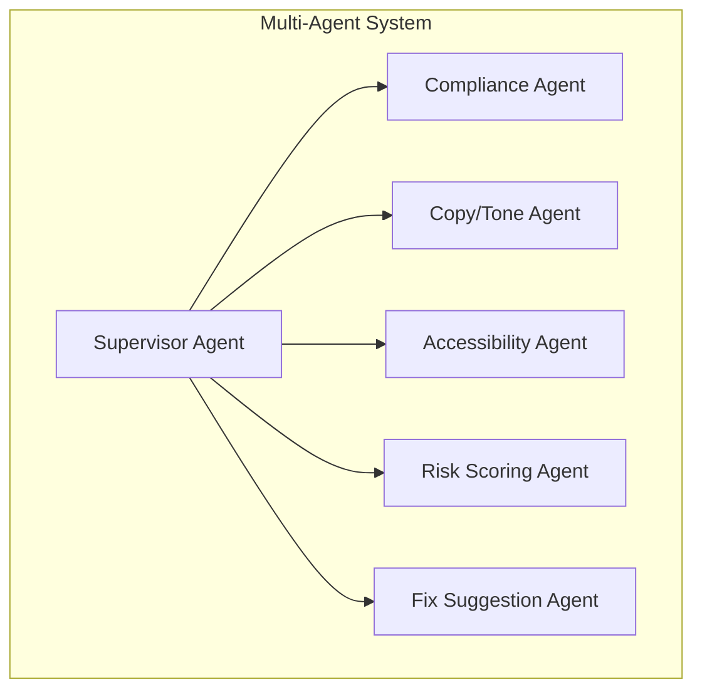

# Email QA Agentic Platform - Agent Documentation

## Overview

The Email QA Agentic Platform uses a multi-agent system to perform advanced email quality analysis. Each agent specializes in a specific aspect of email QA and works collaboratively under the supervision of the Supervisor Agent.

## Agent Architecture



## Agents

### Supervisor Agent

**File**: [backend/agents/supervisor_agent.py](backend/agents/supervisor_agent.py)

The Supervisor Agent is the central coordinator of the multi-agent system. It:

1. Receives email content and metadata from the orchestrator
2. Routes tasks to appropriate sub-agents
3. Collects and merges results from all agents
4. Produces a consolidated QA report

**Input**:
- Email ID
- HTML content
- Metadata
- Deterministic test results

**Output**:
- Overall status (pass/fail/needs_review)
- Risk score (0-100)
- Top issues
- Fix suggestions
- Detailed analysis from all sub-agents

### Compliance Agent

**File**: [backend/agents/compliance_agent.py](backend/agents/compliance_agent.py)

The Compliance Agent ensures emails adhere to brand guidelines. It checks:

1. **Font Family Compliance**: Verifies use of brand fonts
2. **CTA Button Colors**: Ensures call-to-action buttons use brand colors
3. **Spacing Rules**: Validates padding and margins
4. **Logo Placement**: Confirms brand logo is correctly placed
5. **Header/Footer Consistency**: Ensures consistent global elements

**Input**:
- Email ID
- HTML content
- Metadata

**Output**:
- List of compliance issues
- Severity levels for each issue
- Summary of findings

### Copy/Tone Agent

**File**: [backend/agents/tone_agent.py](backend/agents/tone_agent.py)

The Copy/Tone Agent analyzes email content for clarity, tone, and quality. It evaluates:

1. **Clarity**: Ensures messaging is clear and understandable
2. **Tone**: Verifies alignment with brand voice and guidelines
3. **Grammar**: Checks for grammatical errors
4. **Sentence Complexity**: Identifies overly complex sentences
5. **Spam Indicators**: Flags potentially spammy language in subject lines

**Input**:
- Email ID
- HTML content
- Metadata (especially subject line)

**Output**:
- List of copy/tone issues
- Severity levels for each issue
- Summary of findings

### Accessibility Agent

**File**: [backend/agents/accessibility_agent.py](backend/agents/accessibility_agent.py)

The Accessibility Agent ensures emails are accessible to users with disabilities. It evaluates:

1. **ALT Text Quality**: Checks for meaningful alternative text on images
2. **Semantic HTML**: Validates proper heading structure and markup
3. **Color Contrast**: Approximates color contrast compliance
4. **Link Text Clarity**: Ensures links have descriptive text

**Input**:
- Email ID
- HTML content
- Metadata

**Output**:
- List of accessibility issues
- Severity levels for each issue
- Summary of findings

### Risk Scoring Agent

**File**: [backend/agents/risk_scoring_agent.py](backend/agents/risk_scoring_agent.py)

The Risk Scoring Agent calculates an overall risk score for the email based on all identified issues. It:

1. **Aggregates Issues**: Collects issues from all agents
2. **Weights by Severity**: Applies weights based on issue severity
3. **Calculates Score**: Produces a normalized risk score (0-100)
4. **Determines Risk Level**: Classifies risk as low, medium, or high

**Input**:
- Results from all other agents

**Output**:
- Risk score (0-100)
- Risk level (low/medium/high)
- Reasoning for the score

### Fix Suggestion Agent

**File**: [backend/agents/fix_suggestion_agent.py](backend/agents/fix_suggestion_agent.py)

The Fix Suggestion Agent generates actionable recommendations for resolving identified issues. It:

1. **Analyzes Issues**: Reviews all identified problems
2. **Generates Fixes**: Creates specific solutions for each issue
3. **Prioritizes Recommendations**: Ranks fixes by importance
4. **Formats Guidance**: Provides clear implementation steps

**Input**:
- Results from all other agents
- Risk scoring results

**Output**:
- List of fix suggestions
- Priority levels for each fix
- Implementation guidance

## Agent Communication

Agents communicate through structured JSON messages with the following schema:

```json
{
  "agent": "agent_name",
  "email_id": "string",
  "issues": [
    {
      "rule": "string",
      "description": "string",
      "severity": "critical|high|medium|low"
    }
  ],
  "summary": "string"
}
```

## Agent Prompts

Each agent uses specialized prompts to guide its analysis. These prompts are stored in the [backend/agent_prompts/](backend/agent_prompts/) directory:

- [supervisor.txt](backend/agent_prompts/supervisor.txt)
- [compliance.txt](backend/agent_prompts/compliance.txt)
- [tone.txt](backend/agent_prompts/tone.txt)
- [accessibility.txt](backend/agent_prompts/accessibility.txt)
- [risk.txt](backend/agent_prompts/risk.txt)
- [fixes.txt](backend/agent_prompts/fixes.txt)

## Extending the Agent System

To add a new agent to the system:

1. Create a new agent file in [backend/agents/](backend/agents/)
2. Implement the required methods (typically an `analyze` method)
3. Add the agent to the Supervisor Agent
4. Create a corresponding prompt file in [backend/agent_prompts/](backend/agent_prompts/)
5. Update the system documentation

## Performance Considerations

- Agents run sequentially under the Supervisor Agent's control
- LLM-based agents may introduce latency
- Consider caching results for frequently analyzed emails
- Monitor API usage for external services (OpenAI)