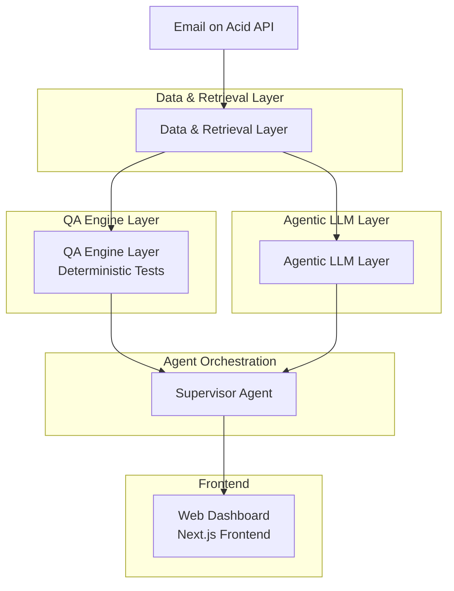
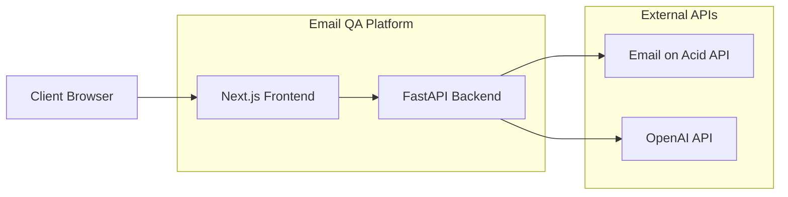

# Email QA Agentic Platform - Architecture

## System Overview



## Layer Details

### 1. Data & Retrieval Layer

This layer handles all data fetching and preprocessing:

- **Email on Acid Connector**: Fetches email proofs and metadata
- **HTML Extractor**: Parses and cleans HTML content
- **Asset Extractor**: Identifies images, links, and other assets

### 2. QA Engine Layer (Deterministic)

Pure code-based validation with no LLM involvement:

- `check_alt_text()` - Validates image ALT attributes
- `check_links()` - Checks for broken or malformed URLs
- `check_subject_line()` - Ensures subject line exists
- `check_preheader()` - Validates preheader text
- `check_template_meta()` - Verifies template metadata
- `check_width()` - Checks element width specifications
- `check_background_color()` - Validates background colors
- `check_image_dimensions()` - Ensures image dimensions
- `check_long_copy()` - Flags excessively long text

### 3. Agentic LLM Layer

Multi-agent system for advanced analysis:

#### Supervisor Agent
- Orchestrates the entire workflow
- Routes tasks to sub-agents
- Merges results from all agents
- Produces consolidated report

#### Compliance Agent
- Font family compliance
- CTA button colors
- Spacing rules
- Logo placement
- Header/footer consistency

#### Copy/Tone Agent
- Clarity of messaging
- Tone according to brand guidelines
- Grammar and language quality
- Long/complex sentence detection
- Spammy language in subject lines

#### Accessibility Agent
- Meaningful ALT text
- Semantic HTML readiness
- Color contrast warnings
- Link text clarity

#### Risk Scoring Agent
- Calculates overall risk score (0-100)
- Determines risk level (low/medium/high)
- Provides scoring rationale

#### Fix Suggestion Agent
- Generates actionable fixes for all issues
- Prioritizes fixes by severity
- Provides implementation guidance

## Data Flow

1. **Email Fetching**: System retrieves email proofs from Email on Acid
2. **Deterministic QA**: Automated checks run on email content
3. **Agent Analysis**: LLM agents perform advanced analysis
4. **Risk Scoring**: System calculates overall risk metrics
5. **Fix Generation**: Actionable suggestions are created
6. **Report Compilation**: All results are consolidated
7. **Dashboard Display**: Results are shown in web interface

## API Contract

### Get Email List
```
GET /api/v1/emails
Response: [{id, name, created_at, status}]
```

### Get Email Details
```
GET /api/v1/emails/{id}
Response: {id, html_content, metadata}
```

### Run QA Analysis
```
POST /api/v1/emails/{id}/qa
Response: {report}
```

### Get Saved Report
```
GET /api/v1/reports/{id}
Response: {report_data}
```

## Technology Stack

### Backend
- **Python 3.9+**
- **FastAPI** - Web framework
- **LangChain** - LLM orchestration
- **BeautifulSoup** - HTML parsing
- **PyYAML** - Configuration management
- **Docker** - Containerization

### Frontend
- **Next.js 14** - React framework
- **TypeScript** - Type safety
- **Tailwind CSS** - Styling
- **React** - UI library
- **Axios** - HTTP client

### LLM Integration
- **OpenAI GPT** - Primary LLM
- **LangChain** - Prompt management
- **Agent Prompts** - Specialized instructions

## Deployment Architecture

